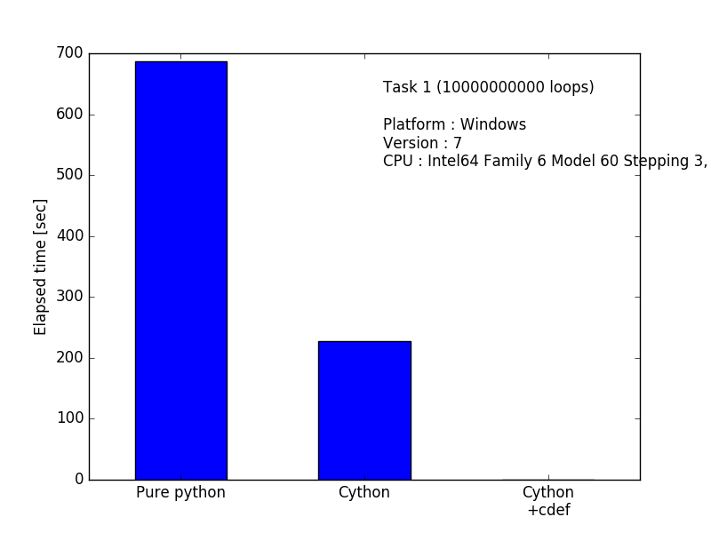

cython_bench
====

# Description
Benchmark script for cython

# Requirement
- Python 2.7.x
- matplotlib

# Usage
## Compile .pyx
`$ python setup.py build_ext --inplace`

## Run the script
`$ python main.py`

# Install
Clone this repository to your local machine with following command  
`$ git clone git@github.com:matsu490/MNISTer.git`  

# Author
[matsu490](https://github.com/matsu490)
